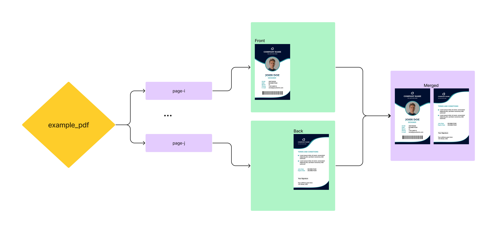

# PDF Image Overlay

This script allows you to overlay two pages of a PDF file and save the result as a new PDF file. This is useful when you want to overlay two scanned images of the same document (e.g. front and back of an ID card) and save the result as a new PDF file.

## Motivation

When scanning something like an ID card or a document piece, it is often useful to display both the front and back on the same page while maintaining proportions of both sides. This script solves this problem by overlaying two pages of a PDF file and saving the result as a new PDF file.



For example, suppose you have already scanned the front and back of an ID card and saved them as the first two pages of `path_to_scanned_doc.pdf`. Then you can run the following command to overlay them on the same page:

    python pdf_image_overlay.py path_to_scanned_doc.pdf 0 1


## Installation

1. Clone this repository to your local machine.
2. Make sure that Python 3.x is installed on your machine.
3. Install the required dependencies by running the following command:

```bash
pip install -r requirements.txt
```


## Usage

To use the script, run the following command:

    python pdf_image_overlay.py input_file_path page1 page2


Replace `input_file_path` with the path to the input PDF file, `page1` with the index of the first page to be overlayed (starting from 0), and `page2` with the index of the second page to be overlayed.

The resulting PDF file will be saved in the same directory as the input file with the suffix `_overlayed` added to the file name.

## Contributing

Contributions are welcome! If you find a bug or have a feature request, please open an issue on this repository. If you want to contribute code, please fork the repository, create a new branch, and make your changes there. Then, create a pull request to merge your changes into the `main` branch.

## License

This project is licensed under the [MIT License](https://opensource.org/licenses/MIT) - see the [LICENSE](LICENSE) file for details.


